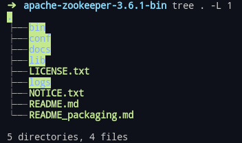
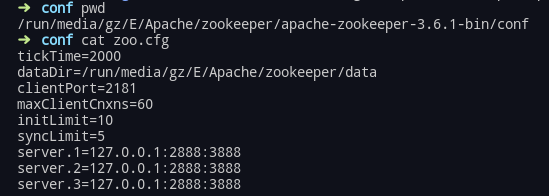

# GIKV(kv-store) Lab Report
**SE347 lab5 郭志 517021910503**

**目录**  

- [实验环境](#%E5%AE%9E%E9%AA%8C%E7%8E%AF%E5%A2%83)
- [设计](#%E8%AE%BE%E8%AE%A1)
- [实现](#%E5%AE%9E%E7%8E%B0)
- [测试](#%E6%B5%8B%E8%AF%95)
- [项目结构](#%E9%A1%B9%E7%9B%AE%E7%BB%93%E6%9E%84)
- [总结](#%E6%80%BB%E7%BB%93)

## 实验环境
### zk集群配置
#### 下载ZooKeeper
从[ZooKeeper官网](https://zookeeper.apache.org/doc/r3.6.1/zookeeperStarted.html)下载ZooKeeper的二进制文件包，解压后文件如下:  

#### 安装ZooKeeper
在单机上部署ZooKeeper的方式比较简单，按照官网下载安装下该zoo.cfg就可以运行一个singlealone模式的ZooKeeper。但为了模拟分布式场景，使得这个项目可用性更高，于是将ZooKeeper部署成replicated 模式：   
在本地将singlealone下的ZooKeeper拷贝成了三份，准备部署三个（奇数节点）ZooKeeper实例，分别设置它们的zoo.cfg,更改它们的myid与zoo.cfg一致   
zoo.cfg示例:   


#### 使用ZooKeeper
运行```bin/zkCli.sh -server 127.0.0.1:2181```即可连接到一个ZooKeeper server
### go 语言版本
整个项目都是用go语言编写，使用的go语言版本是```go1.14.4```
### zk client
较为常用的zookeeper go client有
[gozk](https://wiki.ubuntu.com/gozk)  
[go-zookeeper](http://godoc.org/github.com/samuel/go-zookeeper/zk)  
我选用了后者```go-zookeeper```

### 运行
下载提交的作业压缩包,解压到一目录下(如```/GIKV```),设置GOPATH指向那个目录  
cd 进入```src/main```   
运行命令  ```go run main.go``` go会自动下载依赖包,并运行GIKV客户端

## 设计   

### 节点分布图
.png)
系统存在三类角色，分别是Zookeeper，Master和Worker。其中Zookeeper是一个Zookeeper集群，包含三个server。Master包含一个真正的Master和多个潜在的Master(Slave)。Worker由多个Worker节点构成(初始情况下为10个,可以动态加入删除)，每个Worker包含一个Primary和两个Backup以及一个用来指定当前Primary的ViewServer。

### 命名机制
* GIKV: 项目名称，灵感来源tikv，由于这个项目使用**Go**语言编写，故命名为GIKV
* Master集群： 包含一个Master节点和多个Slave节点。
* Master节点: 一个时刻只有一个Master,负责数据的partition，管理Worker节点，处理对GIKV的调用请求
* Slave节点: Master节点的备份节点, 可以有多个Slave,可以动态添加删除, 也能处理对GIKV的调用请求
* Worker集群： 包括多个Worker节点，满足课件要求中至少两个data node的要求
* Worker节点： 包含了一个Primary节点，两个backup节点，一个viewServer
* Primary节点： 对应课件中要求的data node，负责保存数据
* Backup节点： 是Primary的备份，对应课件中要求data node有standby node
* ViewServer节点： 确定当前Primary（Backup随时有可能成为新的Primary)

### zookeeper  
#### zookeeper目录树
整个ZooKeeper的目录树如下
<p float="left">
  
</p>

* GIKV为项目名称
  * /GIKV/Master 是Master集群的路径
    * /GIKV/Master/Master 保存了当前执行Master工作的Master的RPC 地址
    * /GIKV/Master/Slave 下面有一个当前Slave节点的列表，每个Slave节点保存了这个Slave的RPC 地址
    * /GIKV/Master/Process 下面是当前Master和Slave的列表，每个子节点有对应的RPC 地址
  * /GIKV/Worker 是Worker集群的路径，下面是Worker 节点的列表
    * /GIKV/Worker/$worker/ViewServer 保存了这个worker的ViewServer RPC地址
    * /GIKV/Worker/$worker/Primary 保存了这个worker的Primary RPC地址

### master集群
Master集群的设计要点：
* Master 有多个备份，保障**可用性**
* Master和备份节点(slave)的数据要同步,保障**一致性**
* Master挂掉时，slave通过ZooKeeper的选举机制竞选Master
* Slave节点也可以处理调用请求,用来做**负载均衡**
* Master需要**管理**Worker集群，有新的worker节点加入或者有worker节点宕机，Master需要做出相应处理

<a href="#实现">详细设计讲解见实现一栏</a>

### worker集群
worker集群的设计要点：
* worker集群有多个worker节点，每个worker节点只要管理部分数据，实现**可扩展性**
* 每个key-value数据保存在两个worker节点上，保障数据的**可用性**
* 新的worker节点加入时，需要管理新的数据，数据迁移使用一种**lazy**的策略
* worker节点宕机或者删除时，数据会被转移到其他节点，保障数据的**可用性**
* worker节点中有primary，backup，viewserver三种角色
* primary保存着kv store的key-value数据
* primary有两个backup，来保障服务的**可用性**
* primary和backup需要数据同步迁移，保障**一致性**
* viewserver根据primary和backup的心跳确定新的primary

<a href="#实现">详细设计讲解见实现一栏</a>

### 可用性保障
**高可用性是GIKV的目标之一**
系统中对于可用性的保障大概有以下几点: 
1. zookeeper部署replicated模式而不是standalone
2. master支持有多个备份节点（slave）
3. 数据会保存在两个worker节点上
4. worker节点动态加入和删除会有数据迁移，保障数据可用
5. worker节点内部一个primary有两个backup
6. 竞争条件下的并发操作需要获得对应的锁,这一定程度上降低了可用性,增加了等待时间,但其实避免了错误的发生,使得系统更加健壮

<a href="#实现">详细设计讲解见实现一栏</a>

### 可扩展性保障
**高可扩展性是GIKV的目标之一**
系统中对于可扩展性的保障大概有以下几点:
1. 随时支持新的master加入并工作 
2. 支持worker节点的动态加入与删除
3. 支持数据存储时的data partition
4. **采用一致性哈希算法，并实现了虚拟节点**避免节点删除时数据迁移带来的雪崩现象
5. 新节点加入时采用一种**lazy**的策略避免新节点加入需要做大量数据迁移

<a href="#实现">详细设计讲解见实现一栏</a>

## 实现
### rpc机制
rpc采用go语音的 **net/rpc** 机制,以master为例，为master开启rpc server服务的简短代码如下: 
```go
master.myRPCAddress = port("master", master.label)
rpcs := rpc.NewServer()
rpcs.Register(master)
os.Remove(master.myRPCAddress)

l, err0 := net.Listen("unix", master.myRPCAddress)
```
其中```port("master", master.label)```根据master的标号生成特定的string来作为RPC注册服务的地址。一个RPC地址的实例如下```/var/tmp/824-1000/ms-588673-master-4```   

```rpcs.Register(master)```将master注册RPC 服务，master中符合规范的func（大写字母开头，有两个结构体指针参数，返回error) 都能被外界调用  

```net.Listen("unix", master.myRPCAddress)```使用的是**net/rpc**中unix的rpc方式（因此之前的RPC地址是一个文件路径),还可以使用```tcp```,```tcp4```,```tcp6```的rpc方式，这里是在一台机器上模拟分布式场景，使用 ```unix``` 方式即可满足条件

### master选举机制
master选举策略： 先创建```/GIKV/Master/Master```节点的Master就是Master临时节点，否则为Slave。Slave会对```/GIKV/Master/Master```节点进行监听，如果一旦此时的Master节点挂掉，Zookeeper临时节点session会在一段时间内没有收到Master的Ping过期，```/GIKV/Master/Master```节点被删除，Slave则都会去试图创建```/GIKV/Master/Master```节点，争当Master，当然只有一个Slave能够成功，其他的Slave仍然维持Slave的身份不变，以此类推。  

### master数据同步与负载均衡
master数据同步： master并不需要直接与slave进行通信来同步数据，因为它们都可以通过watch ZooKeeper上的节点来更新元数据。  
master负载均衡： 由于master和slave都保存着相同的worker元数据，对于用户来说无论是和master发请求还是和slave发请求都能得到正确的处理。于是slave可以用来帮助master作负载均衡，降低master节点的负载。具体实现方法是master和slave都会在```/GIKV/Master/Process```用自己的标号注册子节点，用户只需要在这些子节点中随机选择一个发送请求就可以  

### 一致性哈希算法实现
为了实现节数据的partition。一般会使用对key进行hash的方法来判断哪个Worker需要保存这个key-value对。单纯的哈希难以处理动态添加或者删除节点的需要，因为此时基本所有的数据都需要迁移，在GIKV中我采用了**一致性哈希**的算法。  
一致性哈希的基本思想是N个节点随机分布在2^k（在GIKV的实现中，k=64）个点的circle上，每个节点负责自己的哈希值到下一个节点的哈希值中间的数据请求。然后这种单纯的一致性哈希实现在节点删除的时候会出现雪崩的情况，因为一个节点被删除它的数据由下一个节点处理，这导致下一个节点负载过大，很可能会crash掉，于是它的数据有需要传递给下一个节点，如此递归。最后整个系统都将崩溃。  
分布式课堂中讲到过为一致性哈希增加**虚拟节点**的方法，让每个物理节点管理一系列不连续的虚拟节点，这种情况下，一个物理节点宕机后，它的数据会均摊到其他所有节点上，负载均衡，消除了雪崩的危险。  
<p float="left">
  
</p>

***图片来自SE347 分布式系统 2020 LEC 14: Distributed Database***  
于是在GIKV中我实现了一个支持虚拟节点的一致性哈希算法(**每个物理节点有20个虚拟节点**，master利用这个算法会维护一个consistent table，并用来实现put，get，delete操作，以及节点的动态加入与删除

### 数据Partitioin
数据不会存储在所有的Worker节点上,Master会根据consistent hash table找到有关这个key的部分节点,并进行相应处理

### Put操作
基本思路是通过master维护的consistent table找到put参数中key对应的节点(物理节点)并调用这个节点对应Worker的Put RPC来处理。  
但为了保障高可用性，Put操作将会让key对应的物理节点和下一个物理节点中都进行处理，这与**dynamo**的**preference list**的设计比较相似，它是在一致性哈希对应节点后N个节点都有备份。  
<a href="#Get操作">get，delete操作需要考虑节点动态加入删除的情况，故在介绍节点动态变化之后</a>

### master监听worker节点变化
master和slave节点都需要对ZooKeeper的```/GIKV/Worker```节点的```Children```进行监听，如果有新的Worker节点加入或者删除，ZooKeeper会返回一个chEvent：```zk.EventNodeChildrenChanged```，通过比较此时ZooKeeper里的Worker列表与本地保存的Worker列表，master和slave可以知道是新节点加入还是删除，并且都会做出对应的处理： 具体是master和slave都会更改自己关于worker节点的元数据，master节点还需要根据指导被删除的Worker节点（primary依然还在运行）将数据分别传递到合适的节点上。 

### Worker节点动态加入和删除时数据迁移操作
#### 动态加入节点
使用一种**Lazy**的策略，不用马上迁移数据，只需要在**Get**或者**Delete**这个数据的时候进行相应的处理（Put仍然直接Put就行，不需要额外操作，因为允许多个Worker节点一个key有不一样的value存在，只需要保证consistent table中这个key对应的Worker节点有最新的值就行)。  

#### 动态删除节点
删除Worker节点分为两种情况：  
删除Primary，此时ViewServer会从Primary中选取新的Primary出来（<a href="#viewServer机制">见viewServer机制</a>）  
删除ViewServer， ViewServer被删除代表着这个Worker节点被删除掉，但是Master依然能够指挥Worker节点这个时候的Primary进行数据迁移。 具体的数据迁移策略是Primary针对每个key-value数据调用Master的```GetNextNode```接口，得到这个数据在一致性哈希中下一个物理节点对应Worker的RPC地址。然后调用PBServer（非Master,Master的Put会写在两个Worker里,这里只需要保存一次）的Put RPC将数据保存在合适的Worker处。  

### Get操作
Get操作需要考虑两种情况，一个是consistent table中key对应的Worker有这个数据（正常情况），一个是consistent table中key对应的Worker没有这个数据（这个节点是新加入的节点，没有被主动迁移数据）。第一种情况只需要调用consistent服务提供的Get方法，而第二种情况需要调用consistent服务中提供的GetN方法，要把所有的虚拟节点都遍历一遍，按照顺序返回所有的物理节点，性能开销会大许多。因此采用了一种**hierachy**的策略：首先调用Get方法拿到consistent table中对应的Worker并发送Get请求，如果返回不存在，再调用GetN方法拿到所有的物理节点。  
第二种情况，会是节点动态加入时数据迁移lazy策略的主要实现,主要操作如下: 拿到所有的物理节点后，按照顺序一个一个进行查找，如果存在就将这个key-value对调用Master的Put方法保存到consistent table中对应的Worker处，在使用这个数据的时候，完成它的迁移操作。如果所有节点都没有这个key，就返回不存在。  

### Delete操作
由于Delete操作如果直接删除，会导致Get方法继续往下查找，很可能拿到旧值，所有Delete时在对应的Worker处将这个key标记为不存在，Get进行查找时，遇到这个标记直接返回。  

### primary backup机制
每个primary有两个备份节点（backup）。每次primary处理master发来的put请求时会调用backup的put接口将key-value对也同步保存在backup中。同理delete操作也会将backup中的数据删除，而get操作直接由primary返回即可。  
如果加入新的backup节点，primary需要把自己所有的key-value对同步给这个新来的backup，来保障数据的一致性。  
backup会在合适的时间成为下一个primary，<a href="#viewServer机制">具体操作在viewServer机制中</a>  

### viewServer机制
考虑到primary可能会宕机，backup需要成为新的primary，而如何让master知道当前worker节点中哪个是primary，哪个是backup成了一个关键问题，而且考虑到network partition的情况，单纯的让primary告诉master节点自己的身份可能会让不同的master（master的slave也可以处理用户请求）在同一个worker节点认为的的primary不相同，这会导致数据不一致的情况出现。因此需要引入一个第三方来认证当前worker节点里的primary和backup。    
在计算机系统工程课程中，我们有学到过viewServer的知识，它是引入了一个新的节点，来接受primary和backup规律性的心跳，并告诉primary和backup各自的角色，如果出现了primary宕机或者网络连接断掉的情况，viewServer会根据一段时间没有收到来自primary心跳判断出primary已经挂掉，选择一个backup作为新的primary，此时就发生了一个view change。viewServer会记录着primary和backup的信息，需要找primary的节点（上课时讲的是coordinator，这里为master）会先问viewServer。    
primary宕机发生view change的情况如图片所示：  
<p float="left">
  
   
</p>

***图片来自SE227 计算机系统工程 2019 LEC 20: RSM and Paxos***

在GIKV的ViewServer实现中,会让Primary和Backup每0.1s发一次心跳给ViewServer,如果连续五次没有收到一个Primary或者Backup的心跳,ViewServer就认为这个节点挂掉了,并进行相应处理.

### 并发操作锁服务
会产生竞争的数据主要是kv-store中存储的数据（在同时读写删除的时候有竞争），Master维护的consistent table在查找与修改时有竞争。  
为了支持并发操作， Primary在对数据库进行Get，Put，Delete，以及ForwardPut,ForwardDelete,MoveDB,DropDB的时候都需要对db进行上锁，Consistent在Get，GetN,Add，Remove的时候也需要对consistent table进行上锁。  


## 测试
### 模拟分布式环境
分布式环境有很多不确定因素例如:网络丢包,服务器宕机等等. 为了测试出GIKV在分布式环境中的运行情况,实现了一些机制来模拟分布式环境:    
下面简要展示出master在处理每个rpc请求时的代码:  
```go
if err == nil && master.dead == false {
    if master.unreliable && (rand.Int63()%1000) < 100 {
        // discard the request.
        conn.Close()
    } else if master.unreliable && (rand.Int63()%1000) < 200 {
        // process the request but force discard of reply.
        c1 := conn.(*net.UnixConn)
        f, _ := c1.File()
        err := syscall.Shutdown(int(f.Fd()), syscall.SHUT_WR)
        if err != nil {
            fmt.Printf("shutdown: %v\n", err)
        }
        go rpcs.ServeConn(conn)
    } else {
        go rpcs.ServeConn(conn)
    }
}
```
可以看出,通过设置```master.unreliable```的值为true,能够让master在处理rpc请求的时候表现的不稳定,从而模拟出分布式场景中的不确定因素,从而检测出GIKV在分布式环境中的表现.  

### 测试结果与测试覆盖率
<p float="left">
  一致性哈希测试</>
   viewServer测试</> 
   Primary&Backup测试</> 
</p>
Master测试  
<p float="left">
   
   
   
</p>

### 运行client进行测试
为了更好的展示出GIKV的功能以及**高可用性**,**高可扩展性**。我写了一个repl client来整体测试GIKV的功能，repl支持的功能如下：   
  
可以看到通过这个repl client不仅能够测试put，get，delete等kv操作，还能够控制节点的加入与删除，来测试应用的可用性与可扩展性。   
在测试过程中，我开始有**10个**Worker节点，并put了一些值。 在不断kill Worker节点，add Worker节点，知道最后只剩下**1个**Worker节点时，依然能够正确读出key所对应的value。 这充分说明了GIKV的高可用性与高可扩展性。 

## 项目结构

- /consistentservice包含一致性哈希算法的实现和测试
- /github.com/samuel 是go中zookeeper client的包
- /main 包含一个用于测试整个项目功能的repl client，支持put，get,delete,kill,add等操作
- /msservice 包含Master的实现与测试，consistentmaster主要是处理动态加入删除Worker节点的代码，kvmaster主要是处理kv-store请求操作（put，get，delete）操作的代码，zkmaster主要是Master节点进行选举的代码
- /pbservice 包含Primary和Backup的实现与测试
- /utilservice 包含使用到的一些工具函数
- /viewservice 包含viewServer的实现与测试
- /zkservice 包含ZooKeeper的节点路径定义与一些处理函数


## 总结
1. 通过这个Lab认真学习了ZooKeeper的配置与使用,Go RPC, go-routine的使用.
2. 对于分布式场景中一些概念(可用性,一致性,可扩展性,分区容错性)有了深刻的理解.
3. 学习了一些分布式中流行的算法: 如一致性哈希,ZooKeeper选举,ViewServer change view.
4. 动手设计了一个重点在**可用性与可扩展性**的key-value store.它的master node和data node都做了备份,能够支持节点动态加入删除,并保障此时数据的可用性. 
5. 学习了go 测试的技巧并对这个项目进行了比较全面的测试.
6. 整个开发过程比较顺利,学习的速度比较快,能够感受到自己对于分布式的进一步深入理解与编程水平的提高.感到有难度的是对于分布式中crash consistency,high availability, fault tolerance, concurrent processing等场景进行分析,并实现在作业中
7. 最后十分感谢老师和助教布置的这个Lab,让这个学期分布式课程中学到的知识能够付诸实践.
